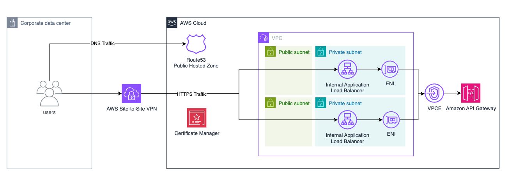

# Amazon Private API Gateway with VPC Endpoints and Public Domain

This pattern creates an Amazon Private API Gateway that is only accessible through VPC endpoints, with public custom domain name resolution for internal only access through an Amazon internal Application Load Balancer.

This architecture is intended for:
- **Internal APIs**: APIs that should only be accessible from within your network
- **Hybrid Connectivity**: APIs accessible from on-premises via VPN/Direct Connect
- **Public DNS Resolution**: APIs that resolve publicly but are only accessible privately

Learn more about this pattern at Serverless Land Patterns: << Add the live URL here >>

Important: this application uses various AWS services and there are costs associated with these services after the Free Tier usage - please see the [AWS Pricing page](https://aws.amazon.com/pricing/) for details. You are responsible for any AWS costs incurred. No warranty is implied in this example.

## Project Structure

```
├── app.py                          # CDK app entry point
├── cdk.json                        # CDK configuration
├── requirements.txt                # Python dependencies
├── private_api_gateway/
│   ├── __init__.py
│   └── private_api_gateway_stack.py # Main stack definition
└── README.md                       # This file
```
## Architecture

- **VPC**: 10.0.0.0/16 with DNS support
- **Subnets**: 2 public + 2 private subnets across 2 AZs
- **NAT Gateway**: Managed by CDK in public subnets
- **Private API Gateway**: PetStore sample API with VPC endpoint restriction
- **Application Load Balancer**: Internal ALB for SSL termination
- **Lambda Automation**: Custom resource for VPC endpoint target registration



## Requirements

1. **Python Environment**: Python 3.8+ with venv
2. **AWS CDK**: Installed and AWS Account bootstrapped
3. **ACM Certificate**: Valid certificate for your domain in the deployment region
4. **AWS CLI**: Configured with appropriate permissions
5. **Custom Domain**: A domain name you control with DNS management access

## Deployment Instructions

### 1. Install Dependencies
```bash
# Create virtual environment
python3 -m venv .venv

# Activate virtual environment
source .venv/bin/activate  # or your venv activation command

# Install CDK dependencies
pip install -r requirements.txt
```

### 2. Get Parameters

You must provide both context parameters:

1. **domain_name**: Your custom domain name (e.g., api.example.com)
2. **certificate_arn**: ARN of your ACM certificate that covers the domain

### 3. CDK Deployment

```bash
# Deploy with both required parameters
cdk deploy \
  -c domain_name=api.example.com \
  -c certificate_arn=arn:aws:acm:region:account:certificate/cert-id

# Example with subdomain
cdk deploy \
  -c domain_name=privateapi.mycompany.com \
  -c certificate_arn=arn:aws:acm:region:account:certificate/<certificate-id>
```

#### Outputs

The stack provides these outputs:
- **VPCId**: VPC identifier
- **ALBDNSName**: ALB DNS name for CNAME record
- **ALBHostedZoneId**: ALB hosted zone ID
- **VPCEndpointId**: VPC endpoint identifier
- **APIGatewayId**: API Gateway identifier
- **CustomDomainName**: Your custom domain
- **APIEndpoint**: Full API URL
- **PublicDNSInstructions**: DNS record to create

### 4. DNS Configuration

After deployment, you must create a DNS record in your domain's hosted zone:

1. **Get ALB DNS name** from CDK outputs
2. **Create CNAME record**:
   ```
   api.example.com -> internal-alb-xxx.region.elb.amazonaws.com
   ```

## Testing

Test from within the VPC (EC2 instance or Client VPN):
```bash
curl https://api.example.com/pets
curl https://api.example.com/pets/2
```

### Expected Responses
```json
# GET /pets
[
  {"id": 1, "type": "dog", "price": 249.99},
  {"id": 2, "type": "cat", "price": 124.99},
  {"id": 3, "type": "fish", "price": 0.99}
]

# GET /pets/2
{
  "id": 2,
  "type": "cat", 
  "price": 124.99
}
```

## Security Features

- API only accessible through VPC endpoint
- Security groups restrict access to VPC and Client VPN ranges
- ALB provides SSL termination with your certificate
- Resource policies enforce VPC endpoint access only

## Troubleshooting

### Certificate Issues
- Ensure certificate is in the same region as deployment
- Verify certificate covers your domain name
- Check certificate validation status

### DNS Issues
- Verify CNAME or ALIAS record points to ALB DNS name
- Check DNS propagation with `nslookup your-domain.com`
- Ensure you have DNS management access for your domain

### Lambda Function Issues
- Check CloudWatch logs for the RegisterVPCEndpointTargets function
- Verify IAM permissions for EC2 and ELB operations

### Target Registration
- Manually check target group health in AWS Console
- Verify VPC endpoint has network interfaces created

## Cleanup

# Destroy

```bash
cdk destroy -c domain_name=api.example.com -c certificate_arn=YOUR-CERT-ARN
```
----
Copyright 2024 Amazon.com, Inc. or its affiliates. All Rights Reserved.

SPDX-License-Identifier: MIT-0

